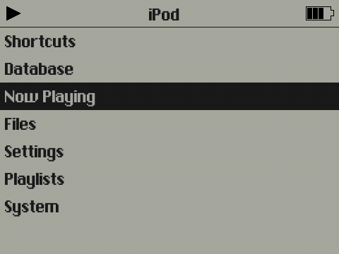
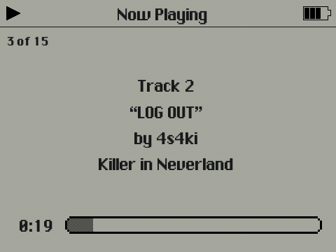
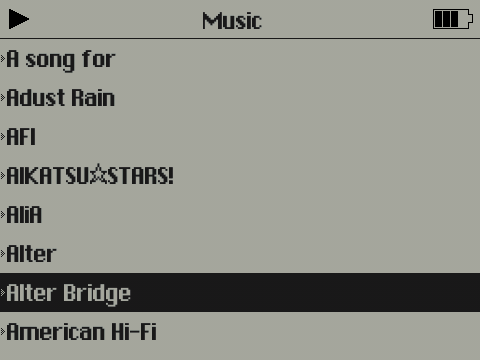

## PodOneY
## 
PodOne Port for Innioasis Y1 & Y2 (360p)

There aren't enough themes that take advantage of the full resolution of the Y1 & Y2, and the 240p version of Rockbox is fine but themes on it look kind of bad on the 480x360 dispolay.
Here's a port of a theme I found and liked. This port is upscaled by hand, with elements redrawn to fit the new resolution. No upscaling algorithms were used for this process.

  

Original author: Guillaume Cocatre-Zilgien <gcocatre@gmail.com> 
Innioasis Y1 360p Port: <a href=https://github.com/AkikoKumagara>AkikoKumagara</a>

Fonts Contained: 
<a href=https://fontstruct.com/fontstructions/show/2230457/chicago-12-13-11>Chicago 12.1</a>
